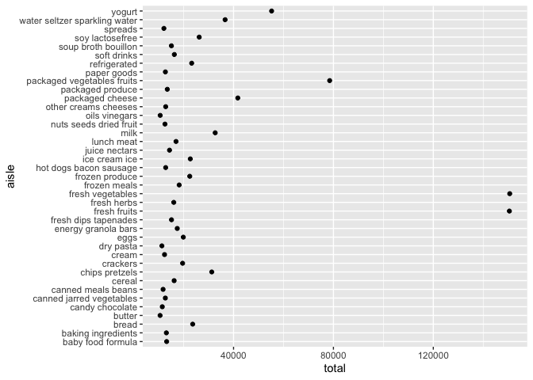

p8105\_hw3\_rt2640
================

``` r
library(tidyverse)
```

    ## ── Attaching packages ─────────────────────────────────────── tidyverse 1.3.1 ──

    ## ✓ ggplot2 3.3.5     ✓ purrr   0.3.4
    ## ✓ tibble  3.1.4     ✓ dplyr   1.0.7
    ## ✓ tidyr   1.1.3     ✓ stringr 1.4.0
    ## ✓ readr   2.0.1     ✓ forcats 0.5.1

    ## ── Conflicts ────────────────────────────────────────── tidyverse_conflicts() ──
    ## x dplyr::filter() masks stats::filter()
    ## x dplyr::lag()    masks stats::lag()

### Problem 1

``` r
library(p8105.datasets)
data("instacart")
```

The instacart dataset contains 1348617 observations and 15 variables.
The dataframe provides a description of the orders on instacart
including the items ordered, a description of their aisles and
respective departments, along with a description of the user, the time
of the order, days since the last order, and items reordered.

#### Problem 1 Part 1

``` r
instacart_df = instacart %>%
  select(order_id:add_to_cart_order,aisle_id:department) %>% 
  group_by(aisle_id , aisle) %>%
  summarise(total = n()) %>%
  arrange(-total)
```

    ## `summarise()` has grouped output by 'aisle_id'. You can override using the `.groups` argument.

There are 134 aisles in total and most items are ordered from the fresh
vegetables aisle 83 (n= 150609) followed by the fresh fruits aisle 24 (n
=150473).

#### Problem 1 Part 2

``` r
dept = instacart_df %>%
  filter(total > 10000) %>%
  arrange(-total)

dept %>%
  ggplot(aes(x = total, y = aisle)) +
  geom_point()
```

<!-- -->
