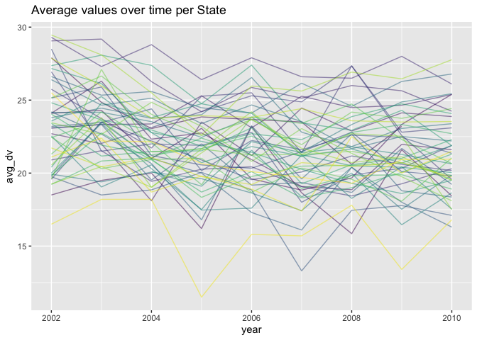
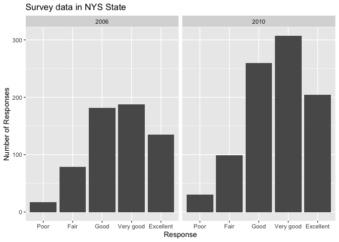

p8105\_hw3\_rt2640
================

``` r
library(tidyverse)
```

    ## ── Attaching packages ─────────────────────────────────────── tidyverse 1.3.1 ──

    ## ✓ ggplot2 3.3.5     ✓ purrr   0.3.4
    ## ✓ tibble  3.1.4     ✓ dplyr   1.0.7
    ## ✓ tidyr   1.1.3     ✓ stringr 1.4.0
    ## ✓ readr   2.0.1     ✓ forcats 0.5.1

    ## ── Conflicts ────────────────────────────────────────── tidyverse_conflicts() ──
    ## x dplyr::filter() masks stats::filter()
    ## x dplyr::lag()    masks stats::lag()

``` r
library(p8105.datasets)
data("instacart")
data("brfss_smart2010")

knitr::opts_chunk$set(
  fig.width = 6,
  fig.asp = .6,
  out.width = "90%"
)

options(
  ggplot2.continuous.colour = "viridis",
  ggplot2.continuous.fill = "viridis"
)

scale_colour_discrete = scale_colour_viridis_d
scale_fill_discrete = scale_fill_viridis_d
```

### Problem 1

The instacart dataset contains 1348617 observations and 15 variables.
The dataframe provides a description of the orders on instacart
including the items ordered, a description of their aisles and
respective departments, along with a description of the user, the time
of the order, days since the last order, and items reordered.

#### Problem 1 Part 1

``` r
instacart_df = instacart %>%
  select(order_id:add_to_cart_order,aisle_id:department) %>% 
  group_by(aisle_id , aisle) %>%
  summarise(total = n()) %>%
  arrange(-total)
```

    ## `summarise()` has grouped output by 'aisle_id'. You can override using the `.groups` argument.

There are 134 aisles in total and most items are ordered from the fresh
vegetables aisle 83 (n= 150609) followed by the fresh fruits aisle 24 (n
=150473).

#### Problem 1 Part 2

``` r
dept = instacart_df %>%
  filter(total > 10000) %>%
  arrange(-total)

dept %>%
  ggplot(aes(x = total, y = aisle)) +
  geom_point()
```


#### Problem 1 Part 3

``` r
baking = instacart %>%
  group_by(aisle_id, aisle,product_name) %>%
  filter(aisle == "baking ingredients") %>%
  summarise(total = n()) %>%
  arrange(-total) %>%
  head(3)
```

    ## `summarise()` has grouped output by 'aisle_id', 'aisle'. You can override using the `.groups` argument.

``` r
dog_food = instacart %>%
  group_by(aisle_id, aisle,product_name) %>%
  filter(aisle == "dog food care") %>%
  summarise(total = n()) %>%
  arrange(-total) %>%
  head(3)
```

    ## `summarise()` has grouped output by 'aisle_id', 'aisle'. You can override using the `.groups` argument.

``` r
pack_veg_fruits = instacart %>%
  group_by(aisle_id, aisle,product_name) %>%
  filter(aisle == "packaged vegetables fruits") %>%
  summarise(total = n()) %>%
  arrange(-total) %>%
  head(3)
```

    ## `summarise()` has grouped output by 'aisle_id', 'aisle'. You can override using the `.groups` argument.

``` r
c1_table = bind_rows(baking, dog_food, pack_veg_fruits) %>%
  janitor::clean_names() %>%
  arrange(-total) %>% 
  as_tibble() %>% 
  knitr::kable()
c1_table
```

| aisle\_id | aisle                      | product\_name                                 | total |
|----------:|:---------------------------|:----------------------------------------------|------:|
|       123 | packaged vegetables fruits | Organic Baby Spinach                          |  9784 |
|       123 | packaged vegetables fruits | Organic Raspberries                           |  5546 |
|       123 | packaged vegetables fruits | Organic Blueberries                           |  4966 |
|        17 | baking ingredients         | Light Brown Sugar                             |   499 |
|        17 | baking ingredients         | Pure Baking Soda                              |   387 |
|        17 | baking ingredients         | Cane Sugar                                    |   336 |
|        40 | dog food care              | Snack Sticks Chicken & Rice Recipe Dog Treats |    30 |
|        40 | dog food care              | Organix Chicken & Brown Rice Recipe           |    28 |
|        40 | dog food care              | Small Dog Biscuits                            |    26 |

#### Problem 1 Part 4

``` r
pla_table = instacart %>%
  group_by(product_name , order_dow) %>%
  filter(product_name == "Pink Lady Apples" | 
           product_name == "Coffee Ice Cream") %>%
  summarize(
    mean_hod = mean(order_hour_of_day)) %>%
  pivot_wider(
    names_from = order_dow,
    values_from = mean_hod
  ) %>%
  rename(
    Monday = "0",
    Tuesday = "1",
    Wednesday = "2",
    Thursday = "3",
    Friday = "4",
    Saturday = "5",
    Sunday = "6",
    Product = "product_name") %>%
  knitr::kable(digit = 2)
```

    ## `summarise()` has grouped output by 'product_name'. You can override using the `.groups` argument.

``` r
pla_table
```

| Product          | Monday | Tuesday | Wednesday | Thursday | Friday | Saturday | Sunday |
|:-----------------|-------:|--------:|----------:|---------:|-------:|---------:|-------:|
| Coffee Ice Cream |  13.77 |   14.32 |     15.38 |    15.32 |  15.22 |    12.26 |  13.83 |
| Pink Lady Apples |  13.44 |   11.36 |     11.70 |    14.25 |  11.55 |    12.78 |  11.94 |

### Problem 2

#### Problem 2 Part 1

``` r
brfss_tidy = brfss_smart2010 %>%
  janitor::clean_names() %>%
  rename(state = locationabbr, location = locationdesc) %>%
  filter(topic == "Overall Health") %>%
  mutate(
    response = factor(response, levels = c("Poor","Fair","Good","Very good",
                                           "Excellent" )))
```

#### Problem 2 Part 2a

``` r
brfss_2002 = brfss_tidy %>%
  filter(year == "2002") %>%
  group_by(state) %>%
  summarise(observed = n()/5) %>%
  filter(observed >= 7)
  

brfss_2010 = brfss_tidy %>%
  filter(year == "2010") %>%
  group_by(state) %>%
  summarise(observed = n()/5) %>%
  filter(observed >= 7)  
```

CT, FL, MA, NC, NJ, and PA are the states with 7 or more observation
sites in 2002. CA, CO, FL, MA, MD, NC, NE, NJ, NY, OH, PA, SC, TX, WA
are the states with 7 or more observation sites in 2010.

#### Problem 2 Part 2b

``` r
excel_df = brfss_tidy %>%
  filter(response == "Excellent") %>%
  group_by(year,state) %>%
  summarise(
    avg_dv = mean(data_value, na.rm = TRUE)
  )
```

    ## `summarise()` has grouped output by 'year'. You can override using the `.groups` argument.

``` r
excel_df %>%
  ggplot(aes(x = year, y = avg_dv, color = state)) +
  geom_line(aes(group = state), alpha = .5) +
  labs(title = "Average values over time per State") +
  theme(legend.position = "none")
```



#### Problem 2 Part 2c

``` r
nys_df = brfss_tidy %>%
  filter(state == "NY", year == "2006" | year == "2010") %>%
  group_by(response, year)

nys_df %>%
  ggplot(aes(x = response , y = data_value)) +
  geom_col() +
  facet_grid(~year) +
  labs(
    x = "Response",
    y = "Number of Responses",
    title = "Survey data in NYS State")
```



### Problem 3

#### Problem 3 Part 1

``` r
accel = read.csv(file = "./accel_data.csv")

accel_df = accel %>%
  janitor::clean_names() %>%
  mutate(
    weekday_vs_weekend = case_when(
      day == "Monday" ~ "Weekday",
      day == "Tuesday" ~ "Weekday",
      day == "Wednesday" ~ "Weekday",
      day == "Thursday" ~ "Weekday",
      day == "Friday" ~ "Weekday",
      day == "Saturday" ~ "Weekend",
      day == "Sunday" ~ "Weekend")) %>%
  rename(day_of_the_week = "day") %>%
  pivot_longer(
    activity_1:activity_1440,
    names_to = "activity_num",
    values_to = "activity_count")
```

The dataset contains 6 variables and 50400 observations. The variables
included are the week, day of the week, whether it is a weekday or a
weekend and activity counts per minute of everyday.

#### Problem 3 Part 2

``` r
activity_day = accel_df %>%
  separate(activity_num, into = c("activity", "minute"), sep = "_") %>%
  group_by(day_id,day_of_the_week,week, weekday_vs_weekend) %>%
  summarize(
    total_activity = sum(activity_count)) %>%
  knitr::kable(digits = 4)
```

    ## `summarise()` has grouped output by 'day_id', 'day_of_the_week', 'week'. You can override using the `.groups` argument.

``` r
activity_day
```

| day\_id | day\_of\_the\_week | week | weekday\_vs\_weekend | total\_activity |
|--------:|:-------------------|-----:|:---------------------|----------------:|
|       1 | Friday             |    1 | Weekday              |       480542.62 |
|       2 | Monday             |    1 | Weekday              |        78828.07 |
|       3 | Saturday           |    1 | Weekend              |       376254.00 |
|       4 | Sunday             |    1 | Weekend              |       631105.00 |
|       5 | Thursday           |    1 | Weekday              |       355923.64 |
|       6 | Tuesday            |    1 | Weekday              |       307094.24 |
|       7 | Wednesday          |    1 | Weekday              |       340115.01 |
|       8 | Friday             |    2 | Weekday              |       568839.00 |
|       9 | Monday             |    2 | Weekday              |       295431.00 |
|      10 | Saturday           |    2 | Weekend              |       607175.00 |
|      11 | Sunday             |    2 | Weekend              |       422018.00 |
|      12 | Thursday           |    2 | Weekday              |       474048.00 |
|      13 | Tuesday            |    2 | Weekday              |       423245.00 |
|      14 | Wednesday          |    2 | Weekday              |       440962.00 |
|      15 | Friday             |    3 | Weekday              |       467420.00 |
|      16 | Monday             |    3 | Weekday              |       685910.00 |
|      17 | Saturday           |    3 | Weekend              |       382928.00 |
|      18 | Sunday             |    3 | Weekend              |       467052.00 |
|      19 | Thursday           |    3 | Weekday              |       371230.00 |
|      20 | Tuesday            |    3 | Weekday              |       381507.00 |
|      21 | Wednesday          |    3 | Weekday              |       468869.00 |
|      22 | Friday             |    4 | Weekday              |       154049.00 |
|      23 | Monday             |    4 | Weekday              |       409450.00 |
|      24 | Saturday           |    4 | Weekend              |         1440.00 |
|      25 | Sunday             |    4 | Weekend              |       260617.00 |
|      26 | Thursday           |    4 | Weekday              |       340291.00 |
|      27 | Tuesday            |    4 | Weekday              |       319568.00 |
|      28 | Wednesday          |    4 | Weekday              |       434460.00 |
|      29 | Friday             |    5 | Weekday              |       620860.00 |
|      30 | Monday             |    5 | Weekday              |       389080.00 |
|      31 | Saturday           |    5 | Weekend              |         1440.00 |
|      32 | Sunday             |    5 | Weekend              |       138421.00 |
|      33 | Thursday           |    5 | Weekday              |       549658.00 |
|      34 | Tuesday            |    5 | Weekday              |       367824.00 |
|      35 | Wednesday          |    5 | Weekday              |       445366.00 |

The subject under observation overall has higher activity during the
weekdays compared to the weekends on average across 5 weeks. He also has
significantly lower total activity on Saturday of Week 4 and Week 5.

#### Problem 3 Part 3

``` r
by_day = accel_df %>%
  separate(activity_num, into = c("activity", "minute"), sep = "_") %>%
  mutate(minute = as.numeric(minute)) %>%
  group_by(day_id,day_of_the_week,week, weekday_vs_weekend)

by_day %>%
  ggplot(aes(x = minute, y = activity_count , color = day_of_the_week)) +
  geom_point() +
  geom_line(alpha = .3) +
  theme(legend.position = "bottom") +
  viridis::scale_fill_viridis(discrete = TRUE)
```


The subject under observation has an overall lower activity on tuesdays
across all 5 weeks of observation. The average activity between 0-400
minutes (night time) is lower across all days. The activity trend on
Fridays is on average higher during the evening hours.
